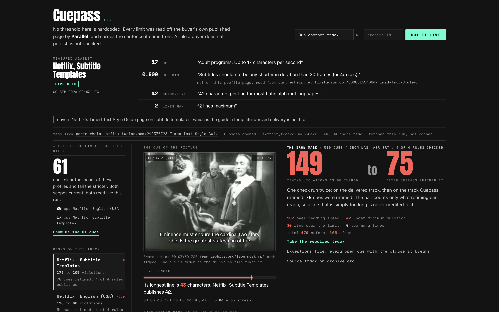
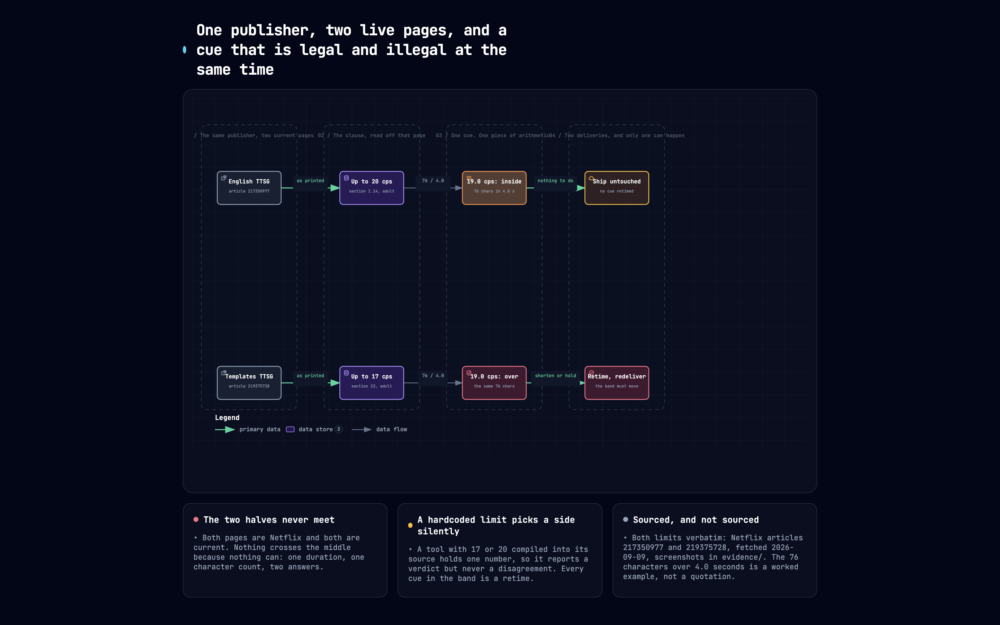
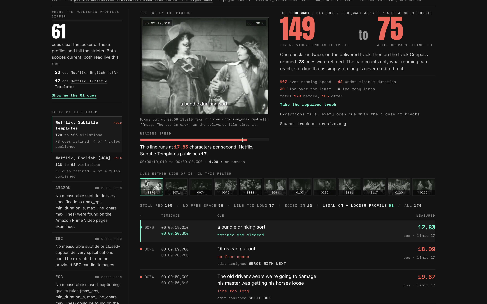
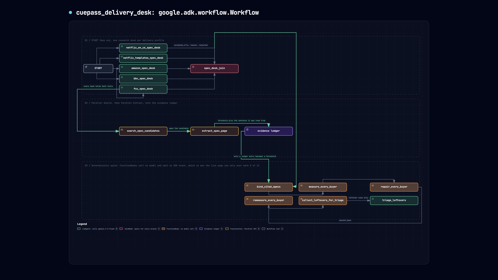
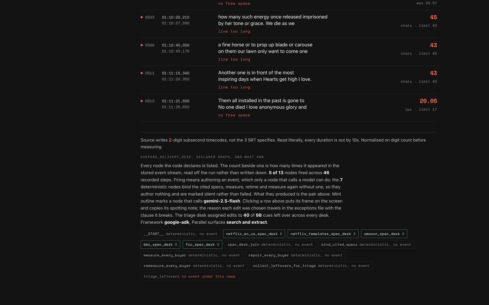
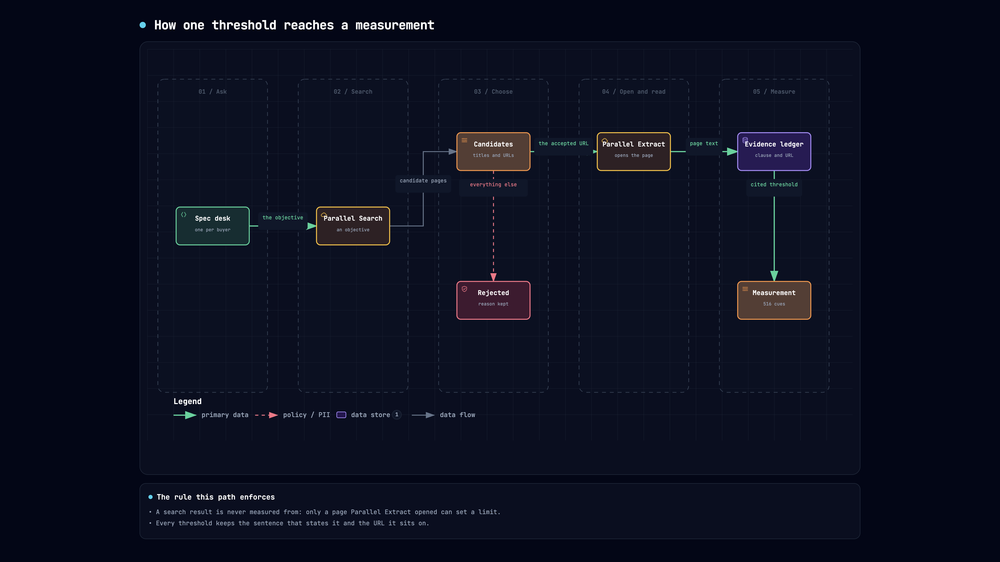
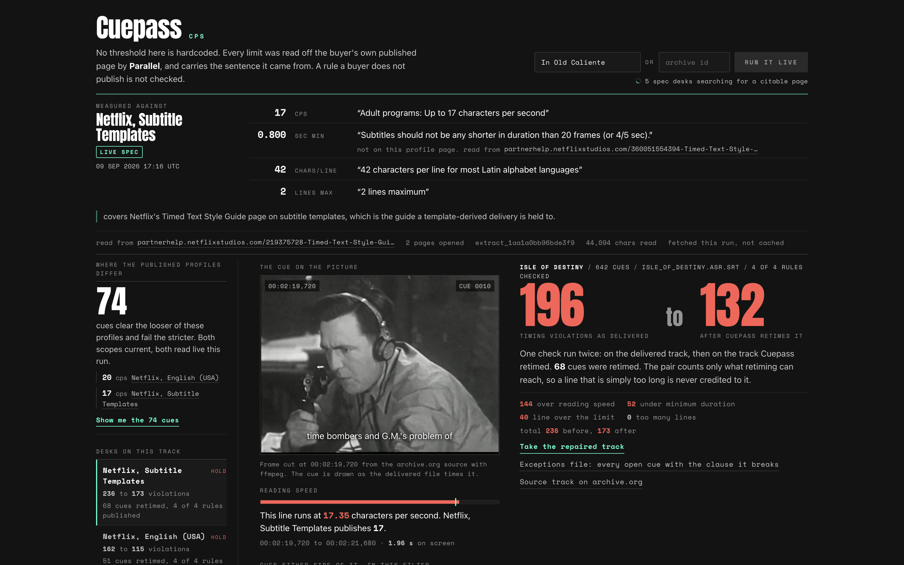

# Cuepass

**Subtitle delivery QC that reads the buyer's limit off the buyer's own page, then proves the repair.**

Live: https://sixteen-seventeen-387894104564.us-central1.run.app

Cuepass measures a film's subtitle track against the caption specification a
platform published, retimes what retiming can fix, measures a second time to
prove it, and hands a human the list it deliberately did not touch.



---

## Which number, not the arithmetic



The flow forks at the first stage and never rejoins, because in the problem it
draws nothing can cross the middle: the file has one duration and one character
count, and the verdict still depends on which Netflix article somebody opened.
The worked example on it, 76 characters over 4.0 seconds, is chosen so the
arithmetic checks by hand. It is not a cue from the fixture below, and the
diagram says so on its own conclusion card.

Both limits are captured as dated evidence rather than quoted from memory:
[`217350977` at 20 cps](docs/problem/evidence/netflix-ttsg-20cps.png) and
[`219375728` at 17 cps](docs/problem/evidence/netflix-templates-17cps.png), both
fetched 2026-09-09, each with its URL and the sha256 of the PNG bytes recorded
in the capture receipt beside them.

Characters divided by seconds is arithmetic. The hard part is that a caption
specification is not a constant.

Netflix publishes two different adult reading-speed limits, on two current pages,
for two delivery scopes:

| Page | Article | Adult | Children's |
|---|---|---|---|
| English Timed Text Style Guide | `217350977` | **20 cps** | 17 cps |
| Timed Text Style Guide: Subtitle Templates | `219375728` | **17 cps** | 15 cps |

```bash
for A in 217350977-English-Timed-Text-Style-Guide \
         219375728-Timed-Text-Style-Guide-Subtitle-Templates; do
  echo "== $A"
  curl -sL "https://partnerhelp.netflixstudios.com/hc/en-us/articles/$A" \
    | grep -oE "(Adult|Children.s) programs?: Up to [0-9]+ characters per second" | sort -u
done
```

```
== 217350977-English-Timed-Text-Style-Guide
Adult programs: Up to 20 characters per second
Children’s programs: Up to 17 characters per second
== 219375728-Timed-Text-Style-Guide-Subtitle-Templates
Adult programs: Up to 17 characters per second
Children’s programs: Up to 15 characters per second
```

A tool with `MAX_CPS = 17` compiled into it holds one of those. It will pass a
file a buyer rejects, and nothing in its output tells you it is measuring against
a number somebody typed years ago.

So Cuepass goes and reads the figure instead of carrying one. Every threshold on
the live path comes out of a page opened during that run, and travels with the
verbatim sentence stating it and the URL that sentence lives on.

## 61 cues between two published pages

The Iron Mask (1929), 516 cues, the ASR subtitle track on archive.org. One file,
one run, both cited profiles:

| | `217350977` at 20 cps | `219375728` at 17 cps |
|---|---|---|
| Cues over reading speed | 46 | **107** |
| Cues under minimum duration | 42 | 42 |
| **Timing failures as delivered** | **88** | **149** |
| Cues retimed | 51 | 78 |
| Timing failures after retiming | 38 | 75 |
| All violations, before to after | 118 to 68 | 179 to 105 |
| Verdict | HOLD | HOLD |

```bash
python - <<'PY'
import measure
srt = open("data/iron_mask.asr.srt").read()
def failing(cps):
    spec = {"max_cps": cps, "min_duration_s": 0.8, "max_line_chars": 42, "max_lines": 2}
    rep = measure.measure_subtitles(srt, spec=spec)
    return rep.summary(), {f["cue_index"] for f in rep.findings_as_dicts()
                           if f["check"] == "reading_speed"}
s20, cues20 = failing(20.0)   # article 217350977
s17, cues17 = failing(17.0)   # article 219375728
for label, s in (("217350977  20 cps", s20), ("219375728  17 cps", s17)):
    print(label, "reading speed", s["over_cps_count"],
          "timing total", s["over_cps_count"] + s["under_duration_count"])
print("clear 20 cps and fail 17 cps:", len(cues17 - cues20))
PY
```

```
217350977  20 cps reading speed 46 timing total 88
219375728  17 cps reading speed 107 timing total 149
clear 20 cps and fail 17 cps: 61
```

61 cues are acceptable under one published Netflix page and unacceptable under
the other. That number cannot exist in a tool that knows one limit.

Only the reading-speed row differs. Minimum duration, line length and line count
are identical, because both pages state the same limits for those. The second
column earns its place on exactly one rule and says so, rather than implying more.

These two figures are not Netflix contradicting itself. They are different scopes: one
is the English (USA) style guide, the other the guide for template-derived
delivery. Cuepass prints the scope beside the number, because which page you are
held to is the question a QC lead is actually asking.

A comparison row is drawn only when two cited pages genuinely differ, guarded by
`test_two_profiles_with_the_same_threshold_produce_no_contrast`. Neither Netflix
profile may pin a reading speed, so neither can borrow the other's figure and
manufacture the gap, guarded by
`test_netflix_profiles_do_not_share_a_pinned_reading_speed`.

It is not one file's coincidence either:

| Film | Cues | Failing at 20 cps | Failing at 17 cps | Cues in the gap |
|---|---|---|---|---|
| The Iron Mask (1929) | 516 | 46 | 107 | **61** |
| Isle of Destiny (1940) | 642 | 70 | 144 | **74** |
| In Old Caliente (1939) | 325 | 21 | 44 | **23** |

## The cue on the picture

A table proves that 61 cues moved. It cannot show you that a line is unreadable,
because reading speed is a claim about a human eye.

So Cuepass cuts the real frame of the real film at each failing cue's own
in-time, from the archive.org source with ffmpeg, and draws the line back onto it
exactly as the delivered file times it.



Cue 0070 runs at 17.83 characters per second for 1.29 seconds. Under `217350977`
it ships. Under `219375728` it does not. The filmstrip beneath is the other 60
cues in the gap, each cut at its own timecode.

```bash
curl -s -o cue.jpg -w "%{http_code} %{content_type} %{size_download}\n" \
  https://sixteen-seventeen-387894104564.us-central1.run.app/frame/iron_mask-69b5d4cf/netflix_templates/70.jpg
#   200 image/jpeg 38934
```

## What one run does

```
                     Parallel Search            Parallel Extract
                     candidate URLs             the page itself
                            |                          |
   START                    v                          v
     |-- netflix_en_us_spec_desk     (LlmAgent, two Parallel tools) --+
     |-- netflix_templates_spec_desk (LlmAgent, two Parallel tools) --+
     |-- amazon_spec_desk            (LlmAgent, two Parallel tools) --+--> spec_desk_join
     |-- bbc_spec_desk               (LlmAgent, two Parallel tools) --+          |
     |-- fcc_spec_desk               (LlmAgent, two Parallel tools) --+          v
                                               bind_cited_specs   (no model)
                                                       v
                                               measure_every_buyer     (no model)
                                                       v
                                               repair_every_buyer      (no model)
                                                       v
                                               remeasure_every_buyer   (no model)
                                                       v
                                               collect_leftovers       (no model)
                                                       v
                                               triage_leftovers   (LlmAgent)
```

That is a real `google.adk.workflow.Workflow`, built in
`cuepass_agents.build_workflow` and exported as `cuepass_agents.root_agent`, the
name ADK's own tooling discovers. The desks run concurrently, one per delivery
profile, because each is an independent research job. A `JoinNode` holds the
deterministic half back until every desk reports.

```bash
python -c "import cuepass_agents as c; print(type(c.root_agent).__name__, c.root_agent.name)"
#   Workflow cuepass_delivery_desk
```

It imports with no credential in the environment, because building the graph
constructs `LlmAgent` objects and reads no key until a node runs
(`test_root_agent_is_importable_with_no_credentials` strips every key and
imports it in a subprocess).

```bash
python -c "
import collections, cuepass_agents
g = cuepass_agents.graph_shape()
print(g['workflow'], len(g['nodes']), 'nodes', len(g['edges']), 'edges')
print(collections.Counter(n['kind'] for n in g['nodes']))
print('model:', cuepass_agents.MODEL)"
```

```
cuepass_delivery_desk 13 nodes 16 edges
Counter({'LlmAgent': 6, 'FunctionNode': 5, 'BaseNode': 1, 'JoinNode': 1})
model: gemini-2.5-flash
```

`graph_shape()` reads the topology off the built graph, and `agent.py` records
which nodes and tool calls actually fired, so the page shows the declared graph
beside the executed one rather than a drawing.

One desk per delivery **profile**, not per company. Netflix gets two because it
publishes two figures for two scopes, and measuring against both is the point.





## Which steps are allowed to be opinions

Six nodes may call a model. Five may not, by construction.

| Step | Who decides | Why that way |
|---|---|---|
| Which candidate page is the buyer's own published spec | `LlmAgent` on gemini-2.5-flash | A host allowlist alone picks press releases; a first-result rule picks whatever won SEO that day. This is a judgement. |
| What number that page states | Python, `read_page_thresholds` | Not a judgement. A model able to author a threshold can author a wrong one, and it would look exactly like a right one. |
| Whether a cue is compliant | `FunctionNode`, no model | Characters divided by seconds. |
| Whether the retime worked | `FunctionNode`, no model, run again on the repaired file on disk | A model asked "did the repair work" will say yes. |
| What a human should do with a cue retiming cannot clear | `LlmAgent` on gemini-2.5-flash | Split, rewrite, merge or request a waiver is an editorial call, and it changes an artefact rather than a number. |

A `FunctionNode` authors no ADK event, so the provenance panel marks 5 of the 13
declared nodes as having fired and names the rest silent rather than failed. That
is the shape of the graph, printed.

`SpecChoice`, the desks' output schema, has three fields: `accepted_urls`,
`reason`, `rejected`. Not one of them can hold a number. Thresholds enter a
measurement only through an evidence ledger keyed by URL that only
`extract_spec_page` writes to, so a desk naming a page nobody opened gets an
error rather than a spec. `test_the_model_is_never_asked_for_a_threshold` and
`test_a_url_nobody_opened_cannot_become_a_spec` hold that line.


## Parallel CLI verify (deepener)

## Parallel CLI verify (deepener)

Cuepass uses the `parallel-web` SDK at runtime. The same Search then Extract chain can be replayed from the shell with `parallel-cli`:

```bash
# install (one of)
brew install parallel-web/tap/parallel-cli
# or: pipx install "parallel-web-tools[cli]" && pipx ensurepath
# or: curl -fsSL https://parallel.ai/install.sh | bash

export PARALLEL_API_KEY=...   # https://platform.parallel.ai
./scripts/verify_parallel_cli.sh
```

The script searches Netflix partner-help hosts with the same objective family as `netflix_en_us`, prints `search_id` / `session_id` / ranks, then Extracts the first official-host URL. Exit non-zero if Search returns no official host or Extract is empty.

### Live verify output (Mac, OAuth)


Observed output (trimmed):

```
PARALLEL_API_KEY unset; using parallel-cli stored OAuth credentials.
== Search (netflix_en_us hosts) ==
search_id: search_2f4fe5720f8e8755c02db25d5a91f49c
session_id: cuepass-verify-1788984140
results: 10
picked official rank 1: https://partnerhelp.netflixstudios.com/hc/en-us/articles/217350977-English-USA-Timed-Text-Style-Guide
== Extract (session-linked) ==
extract_id: extract_8ee26f1b850efd715a3434aae4029cd5
extract_url: https://partnerhelp.netflixstudios.com/hc/en-us/articles/217350977-English-USA-Timed-Text-Style-Guide
search_id: search_2f4fe5720f8e8755c02db25d5a91f49c
session_id: cuepass-verify-1788984140
search_rank: 1
chars_in_extract_payload: 61966
cps_sentences_found: ['17', '20']
OK: Parallel CLI Search then Extract mirrored Cuepass netflix_en_us path.
```

This is the same Netflix EN-US page Cuepass measures against (20 cps adult / 17 cps children).


## Live Parallel pytest

```bash
export PARALLEL_API_KEY=...
pytest test_real_data.py -k parallel_search_then_extract -q
```

Without the key that test is skipped. With the key it must pass: Search returns a `session_id`, Extract opens a citable page, and at least one threshold is read from the page text.

## Parallel is two surfaces, and both are load-bearing

Search finds candidate pages, and is not allowed to produce a number.
`client.search()` returns URLs and snippets. A snippet saying "17 characters per
second" could have come from a blog restating a spec that has since changed, so
Cuepass treats Search output as a menu of pages and nothing more.

Search is also the only way a URL gets onto that menu. `extract_spec_page`
refuses any URL that was not returned by a `search_spec_candidates` call in the
same run: a constant in `parallel_spec.py` and a URL the model remembers from
training are both refused before the fetch, so neither reaches the evidence
ledger and neither can become a measurement. Every cited page carries how it was
found, `parallel_search` with the search id, the rank and the queries, or
`seed_fallback`, and that label rides into the stored run and onto the page.

There is one URL written in this repository,
`parallel_spec.SEARCH_FAILURE_FALLBACK_URLS`, and it fires on exactly one
condition: **Parallel Search returned zero candidates on any host that profile
publishes on** (`OFFICIAL_HOSTS`). One official-host result and it is not
offered, not sorted, and not extractable. It holds no number. Even on that
branch the page is still opened by Extract and every threshold still comes off
the extracted text with its sentence, and the interface says the run stood on
the fallback instead of a discovery.

```
$ pytest test_spec_integrity.py -q -k "hardcoded or invented_url or fallback_fires"
4 passed, 66 deselected
```

| Guard | Holds |
|---|---|
| `test_search_finds_the_url_and_the_hardcoded_one_is_not_offered` | Search returned an official page, so no URL from source is on the desk's menu |
| `test_the_hardcoded_url_cannot_be_extracted_when_search_succeeded` | not offered also means not fetched, not in the ledger, not a spec |
| `test_a_model_invented_url_is_refused_even_on_the_right_host` | the desk cannot type an address, even a plausible one |
| `test_the_fallback_fires_only_on_no_official_result_and_says_so` | the one branch that uses a stored URL, and the label it carries |

Extract opens the page. `client.extract(urls=[...], session_id=...)` pulls
the page as markdown, carrying the `session_id` Search returned so the two calls
are one piece of agent work. Every threshold is read from that extracted text by
`parallel_spec.read_page_thresholds`, in Python, and keeps the sentence it was
read from.

**Remove Parallel and there is no product.** No key, no run:
`ParallelUnavailableError`. There is no cached-constants mode, because a tool
that silently swapped in constants would be citing a page it never read.





### A spec is spread across pages, and each threshold keeps its own

The English (USA) style guide states the reading speed and the line length but
not the line count or the minimum duration, so the desk keeps opening pages until
it has all four. From the Isle of Destiny run:

| Rule | Value | The sentence it was read from | Read from |
|---|---|---|---|
| Reading speed | 20 cps | "Adult programs: Up to 20 characters per second" | `articles/217350977` |
| Line length | 42 chars | "42 characters per line" | `articles/217350977` |
| Lines per subtitle | 2 | "2 lines maximum" | `articles/215758617` |
| Minimum duration | 0.800 s | "Subtitles should not be any shorter in duration than 20 frames (or 4/5 sec)." | `articles/360051554394` |

Every value carries its own URL rather than inheriting the profile's headline
citation, and the interface links each number to the page behind it.

Two rules have a pinned fallback, the minimum on-screen duration and the minimum
gap between subtitles, because both live on Netflix timing pages that neither
profile's headline article states or links, and a desk does not always land
there. When a pin fires the value carries the Netflix page it is published on
and that page's exact sentence, and is labelled `fallback` everywhere it appears.
Reading speed is never pinned for either profile. The pinned values are
`PINNED_FALLBACKS` in `parallel_spec.py`; there is nothing else, and pinning a
third rule fails the build rather than quietly widening this paragraph
(`test_only_the_documented_rules_are_pinned_and_every_pin_is_cited`).

Amazon, the BBC and the FCC are shown as **no citable spec page**, with the
reason their desk gave and the URLs it tried. The BBC's subtitle guidelines are
client-rendered, so Extract returns a page shell; Amazon's content guide is a PDF
behind a help shell; the FCC publishes caption quality rules about accuracy and
synchronicity and states no reading-speed figure. A column absent with a reason
is information. A column filled with a plausible number would be the one
genuinely disqualifying thing this tool could do.

## A check that never ran is not a passing check

This is the guard worth reading in the code.

One run landed on the Subtitle Templates article, which states reading speed and
line length but not minimum duration. `min_duration_s` came back as None, the
duration check quietly did not run, and **42 real violations were reported as
zero**. A zero in a violation column reads as clean.

Three things now stop that:

1. Every threshold carries a **provenance**: `live`, read off a page this run, or
   `fallback`, the buyer's published value pinned in code with the page and the
   sentence it appears on, used only to fill a gap.
2. A check with no threshold reports **`None`, never `0`**, and its name lands in
   `checks_not_verifiable`. The interface has to say "not verifiable against the
   live spec". It cannot render a tick.
3. Each desk opens up to four pages to cover all four rules, and every threshold
   keeps the URL it came from.

A related guard came out of the BBC page. The metadata row
`Translator's Name |TN |[Up to 32 characters]` was being read as a 32-character
line-length limit and measured against. A number is not a rule because it is the
right size: the sentence it sits in has to be about the thing being measured.

### The bug that made the result worse than it is

An earlier run of the English (USA) profile reported 89 to 65 where it now
reports 88 to 38. That 65 was wrong, in the direction that made the product look
weaker.

SRT stores milliseconds. Subtracting two float seconds does not:
`133.79 - 132.99` is `0.79999999999998295`. A cue the repair had retimed to
exactly 800 ms then re-measured as failing an 800 ms minimum, by one part in ten
to the fourteenth. The sheet printed rows reading **"0.800 s, limit 0.8, fail"**
and **"20.00 cps, limit 20, fail"**. On the real track that put 16 duration cues
and 11 reading-speed cues back into the after-count: **27 of the 65 reported
leftovers were arithmetic noise**, understating the repair by around 40 percent,
and inviting the one objection this product cannot survive, that it flags a cue
which meets the spec.

Comparisons now happen at the precision SRT actually stores, integer
milliseconds, and reading speed at the two decimal places the sheet prints. The
same fault had also left 13 cues failing with no recorded reason. Both are gone:
on that profile 68 cues still fail, 105 on the stricter one, and every one of
them carries a reason.

### How the counting works, because two honest parsers disagree

A cue shorter than the minimum duration is reported **once**, as a
minimum-duration failure. Its reading speed is not also reported, because
extending it to the minimum is the same single repair, and reporting both would
count 20 cues twice.

Counting every positive-duration cue over the limit gives a higher reading-speed
number than counting only those long enough to be measured for reading speed.
Both are defensible; Cuepass does the second, and says so, because the total it
feeds is a count of repairs needed rather than a count of rule breaches.

Two cues in this file have an out-time at or before their in-time. They are a
real defect in the source, reported as `non_positive_duration` rather than as
"0.0 seconds", and nothing divides by them.

## What the page shows without being asked

Cuepass opens on a real prior measurement, at zero clicks. `data/runs/` holds a
run produced by `python seed_run.py`, which drives the same graph against the
same file and writes down whatever came out. It carries `measured_at` and the
page shows it. Nothing on the landing screen is typed by hand.

Persistence is two layers, in `runstore.py`. Seed runs are baked into the image,
so a cold container is never empty. Runs finished by a live container are written
to `CUEPASS_RUN_DIR` (`/tmp` on Cloud Run, whose filesystem is read-only
elsewhere) and listed alongside the seeds. The source and repaired tracks are
stored next to the record, so a download link still resolves after the process
that made it is gone.

## Where a human takes over

Retiming clears what free space allows. Everything left gets a reason from the
same arithmetic the repair ran (`no free space`, `min duration boxed in`,
`line too long`) and then an action from the triage desk: `split_cue`,
`rewrite_shorter`, `merge_with_next`, `request_waiver`, with one clause a
spotting editor can act on.

That is the exceptions file, and it is a download rather than a screenshot. Each
row carries the cue, the measured value, the limit, **the sentence from the
buyer's own page that set that limit**, and the action. It is the artefact the QC
lead sends on.

Repair extends cue out-times into space the next cue is not using. It never
rewrites text, so a line that is simply too long is queued for a human rather
than machine-edited, and never credited to the repair in the headline pair.

### The repair has to pass the page it repaired against

Extending an out-time closes the gap in front of that cue, and the gap between
subtitles is a delivery rule in its own right. Netflix states it three times on
the timing guidelines page: **"Subtitles must have a minimum of 2 frames between
them."**

Cuepass used to close those gaps to one frame, a 42ms constant in the repair.
The repaired file therefore failed the same page it had been repaired against,
and nothing caught it, because the gap rule was not read off any page and no
check measured it. On the shipped track that put one fresh violation into the
20 cps file and four into the 17 cps file, under a verdict saying the track had
improved.

`min_gap_s` is now the fifth threshold, read off the extracted page text in
Python with its verbatim clause, exactly like the other four.
`remeasure_every_buyer` reads the repaired file back and raises if the repair
narrowed any gap below the cited minimum:

```bash
python - <<'PY'
import measure
src = open("data/iron_mask.asr.srt").read()
for cps in (20.0, 17.0):
    repaired, changed = measure.remediate_subtitles(src, max_cps=cps, min_duration_s=0.8)
    source_defects = measure.assert_repair_kept_gaps(src, repaired)   # raises if it did
    print(f"{cps:>5} cps  {changed} cues retimed  0 gaps introduced "
          f"({len(source_defects)} already under the minimum in the source)")
PY
```

```
 20.0 cps  51 cues retimed  0 gaps introduced (269 already under the minimum in the source)
 17.0 cps  78 cues retimed  0 gaps introduced (269 already under the minimum in the source)
```

Drive the same function with the old 42ms and it raises, which is what
`test_a_repair_working_to_one_frame_is_caught` asserts: a post-condition that
cannot fail proves nothing.

The 269 pairs the source already delivers under the minimum are the source's
defect, not the repair's, and they are kept separate. Extending an out-time can
only close a gap, never open one, so no retime can fix them and none is claimed.

Verdicts are `DELIVER` and `HOLD`, not legal or illegal. A caption style guide is
a buyer's acceptance criterion, not a statute.

## Scope

Cuepass measures SubRip. The demonstration corpus is public-domain features with
ASR subtitle tracks on archive.org, because they are real files with real defects
that anyone can download and check against these numbers.

`min_duration_s` is derived at 24 fps when a page states frames without a rate.
Netflix states both the frame count and the fraction, and the fraction wins.

Parallel Extract does not return identical content for the same URL on every
call, so no run makes a standing claim about what a page says. Each run records
its own `extract_id`, character count and clauses, and the interface prints them.

## How to run

```bash
git clone https://github.com/aarav1656/sixteen-seventeen
cd sixteen-seventeen
python3 -m venv .venv && source .venv/bin/activate   # Python 3.10+, ADK needs it
pip install -r requirements.txt

export PARALLEL_API_KEY=...
export GOOGLE_GENAI_USE_VERTEXAI=true
export GOOGLE_CLOUD_PROJECT=...          # or export GOOGLE_API_KEY=...

uvicorn app:app --reload --port 8000
```

Without either credential the run raises. Measurement and repair themselves are
pure Python in `measure.py` and are unit-tested with no key at all.

Regenerate the landing measurement:

```bash
python seed_run.py            # or: python seed_run.py <archive.org identifier>
```

It exits non-zero if the run it produced has no timing violations, because a
landing page that opens on a clean file demonstrates nothing.

Drive one full pass against the deployed service:

```bash
curl -s -X POST https://sixteen-seventeen-387894104564.us-central1.run.app/run \
  -F identifier=isle_of_destiny -o run.json \
  -w "HTTP %{http_code} %{size_download} bytes in %{time_total}s\n"
#   HTTP 200 143954 bytes in 59.624s
```

### Tests

```bash
pytest tests.py test_spec_integrity.py test_real_data.py -q -rs
node tests_sheet_filter.js
```

```
110 passed, 1 skipped
SKIPPED [1] test_real_data.py:106: PARALLEL_API_KEY not set
83 checks, PASS
```

The skip is the live Parallel round trip, which needs `PARALLEL_API_KEY`. That
path is exercised instead against the deployed service, where the key lives.
Everything else runs with no credential.

`test_spec_integrity.py` is the suite worth reading. Every test in it guards a
bug that actually happened, and every one has been checked in both directions:
the bug put back, the test confirmed red, the bug removed, the test confirmed
green.

| Guard | Break it by | Goes red |
|---|---|---|
| A check that never ran reports None, not 0 | making `summary()` return the count anyway | `test_unmeasured_check_never_reports_zero` |
| A number needs a sentence about the rule | making `_clause_is_about` return True | `test_number_in_an_unrelated_sentence_is_not_a_rule` |
| The default title must fail | pointing `DEFAULT_FILM` at the 14-cue trailer | `test_default_film_is_a_track_that_fails` |
| A contrast needs two genuinely different specs | letting `_contrasts` compare equal thresholds | `test_two_profiles_with_the_same_threshold_produce_no_contrast` |
| Neither profile may pin a reading speed | adding `max_cps` to the pinned fallbacks | `test_netflix_profiles_do_not_share_a_pinned_reading_speed` |
| Only the documented rules are pinned, and every pin is citable | pinning a third rule, or emptying a pin's clause | `test_only_the_documented_rules_are_pinned_and_every_pin_is_cited` |
| The repair leaves the gap the buyer publishes | putting the 42ms one-frame ceiling back | `test_the_repair_leaves_the_cited_gap_in_front_of_every_cue_it_extends` |
| That gap guard can fail | never; it is driven with the old constant on purpose | `test_a_repair_working_to_one_frame_is_caught` |
| A gap rule is not read out of the sentence beside it | restoring the loose `gap ... N frames` pattern | `test_the_forbidden_band_sentence_is_not_read_as_the_gap_minimum` |
| Every repaired timecode is a valid one | rounding the millisecond field on its own again | `test_a_repaired_out_time_on_a_minute_boundary_is_a_valid_timecode` |
| `root_agent` imports with no credential | making it a factory, or deleting it | `test_root_agent_is_importable_with_no_credentials` |
| A pinned value reaches the page as `fallback`, never as `live` | making `spec_from_ledger` label the pin `live` | `test_a_pinned_threshold_is_never_labelled_live` |
| Only a page Extract opened becomes a spec | letting `spec_from_ledger` accept any URL | `test_a_url_nobody_opened_cannot_become_a_spec` |
| The model has no field for a threshold | adding `max_cps` to `SpecChoice` | `test_the_model_is_never_asked_for_a_threshold` |
| A cue repaired to exactly the limit passes | comparing float seconds again | `test_a_cue_exactly_at_the_limit_passes` |
| The repair and the re-measure agree | comparing float seconds again | `test_repair_output_remeasures_without_phantom_failures` |
| The live run endpoint can own an event loop | putting `async` back on `app.run` | `test_the_live_run_endpoint_can_own_an_event_loop` |

## Files

```
parallel_spec.py    Parallel Search then Extract; reads thresholds with their
                    verbatim clause; the evidence ledger
cuepass_agents.py   the ADK Workflow graph, its nodes and their output schemas
agent.py            drives one invocation, records the executed trace, shapes the run
measure.py          all measurement and repair; pure Python, no model
runstore.py         durable runs, the read API the web layer calls
archive.py          archive.org fetch
seed_run.py         regenerates the landing measurement
app.py              FastAPI, the interface, and the frame cutter
```

Partner wiring in detail: [ARCHITECTURE.md](ARCHITECTURE.md). Design tokens:
[DESIGN.md](DESIGN.md).

## License

MIT. See [LICENSE](LICENSE).
