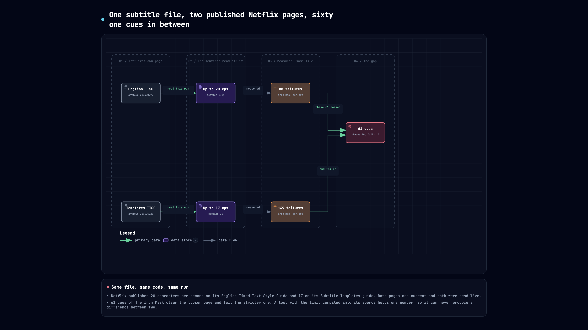
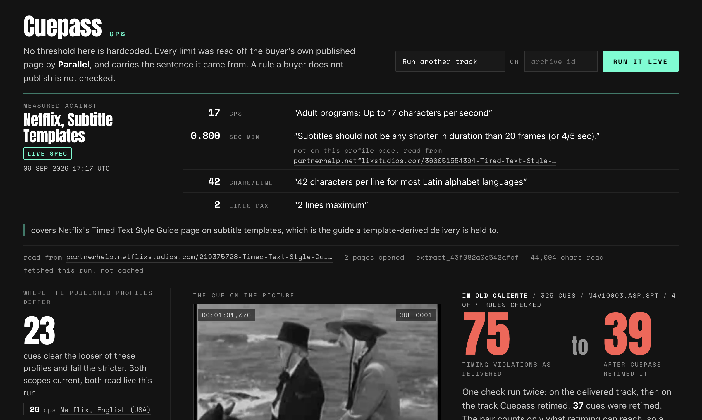

# Cuepass

The Devpost submission text, field by field. Every number carries the command or the URL that produced it.

---

## 1. Project name

Cuepass

## 2. Elevator pitch

> Netflix publishes 20 characters per second on one page and 17 on another. Cuepass reads both live and shows the 61 cues of The Iron Mask that clear one page and fail the other.

**176 characters**, against Devpost's 200 limit.

```bash
printf '%s' "Netflix publishes 20 characters per second on one page and 17 on another. Cuepass reads both live and shows the 61 cues of The Iron Mask that clear one page and fail the other." | wc -c
#      176
```

## 3. About the project

Netflix publishes two adult reading-speed limits on two current pages. This section runs in two columns the whole way down, because the product does.

| | Left column | Right column |
|---|---|---|
| Netflix page | English Timed Text Style Guide | Timed Text Style Guide: Subtitle Templates |
| Article | `217350977` | `219375728` |
| Adult reading speed | **20 cps** | **17 cps** |
| Children's reading speed | 17 cps | 15 cps |
| The sentence on the page | "Adult programs: Up to 20 characters per second" | "Adult programs: Up to 17 characters per second" |
| Who it covers | an English subtitle file for the US catalogue | a template-derived delivery |

Both pages are current. Both were read straight off Netflix's partner help centre:

```bash
for A in 217350977-English-Timed-Text-Style-Guide \
         219375728-Timed-Text-Style-Guide-Subtitle-Templates; do
  echo "== $A"
  curl -sL "https://partnerhelp.netflixstudios.com/hc/en-us/articles/$A" \
    | grep -oE "(Adult|Children.s) programs?: Up to [0-9]+ characters per second" | sort -u
done
```

```
== 217350977-English-Timed-Text-Style-Guide
Adult programs: Up to 20 characters per second
Children’s programs: Up to 17 characters per second
== 219375728-Timed-Text-Style-Guide-Subtitle-Templates
Adult programs: Up to 17 characters per second
Children’s programs: Up to 15 characters per second
```

A subtitle QC tool with `MAX_CPS = 17` in its source holds one of those numbers. It can tell you a file passes, or that it fails. It can never tell you the file sits between two things Netflix published, because it only ever knew one of them.



### Inspiration

A distributor delivers a finished restoration and it comes back four weeks later, rejected on caption spec. The frustrating part is not that somebody measured wrong. It is that "the Netflix limit" is not a single fact.

Netflix's own partner documentation makes that concrete. Article `217350977` is the English Timed Text Style Guide, and its reading-speed section gives adult programs up to 20 characters per second. Article `219375728` is the Timed Text Style Guide for subtitle templates, and its reading-speed section gives adult programs up to 17. Neither page is stale and neither is wrong. They are two scopes, published in parallel, and which one a delivery is held to depends on how that delivery was authored. The same fork appears at the children's tier, 17 against 15.

So the interesting question is not "does this file pass Netflix". It is "how far does the answer move between the two pages Netflix publishes", and nothing can answer that while carrying a constant.

### What it does

Cuepass runs one research desk per delivery profile. Each desk finds and opens its own profile's published page, and the thresholds are read out of that page's text. The same subtitle file is then measured against every cited spec, retimed, and measured a second time.

Run it on The Iron Mask (1929), 516 cues, the ASR subtitle track published on archive.org. The two columns stay apart the whole way down:

| Stage | Left: article `217350977` | Right: article `219375728` |
|---|---|---|
| Reading speed read off the page | 20 cps | 17 cps |
| Minimum duration | 0.800 s | 0.800 s |
| Line length | 42 chars | 42 chars |
| Lines per subtitle | 2 | 2 |
| Cues over reading speed | 46 | **107** |
| Cues under minimum duration | 42 | 42 |
| **Timing failures as delivered** | **88** | **149** |
| Cues retimed | 51 | 78 |
| Timing failures after retiming | 38 | 75 |
| All violations, before to after | 118 to 68 | 179 to 105 |
| Verdict | HOLD | HOLD |

Exactly one row differs on the way in: reading speed. Minimum duration, line length and line count are identical, because both pages state the same limits for those. A matrix whose every column agreed would be decoration. This one earns its second column on one rule.

That one rule is worth 61 cues:

```bash
python - <<'PY'
import measure
srt = open("data/iron_mask.asr.srt").read()
def failing(cps):
    spec = {"max_cps": cps, "min_duration_s": 0.8, "max_line_chars": 42, "max_lines": 2}
    rep = measure.measure_subtitles(srt, spec=spec)
    return rep.summary(), {f["cue_index"] for f in rep.findings_as_dicts()
                           if f["check"] == "reading_speed"}
s20, cues20 = failing(20.0)   # article 217350977
s17, cues17 = failing(17.0)   # article 219375728
for label, s in (("217350977  20 cps", s20), ("219375728  17 cps", s17)):
    print(label, "reading speed", s["over_cps_count"],
          "timing total", s["over_cps_count"] + s["under_duration_count"])
print("clear 20 cps and fail 17 cps:", len(cues17 - cues20))
PY
```

```
217350977  20 cps reading speed 46 timing total 88
219375728  17 cps reading speed 107 timing total 149
clear 20 cps and fail 17 cps: 61
```

61 is not a rounding of anything. It is the set difference between two published pages measured on one file, and it exists only because both thresholds arrived from outside the source code.

It is also not one file's coincidence. Two more public-domain features were run on the deployed service, and the gap between the two pages opens on each of them:

| Film | Cues | Failing at 20 cps | Failing at 17 cps | Cues in the gap |
|---|---|---|---|---|
| The Iron Mask (1929) | 516 | 46 | 107 | **61** |
| Isle of Destiny (1940) | 642 | 70 | 144 | **74** |
| In Old Caliente (1939) | 325 | 21 | 44 | **23** |

```bash
curl -s https://sixteen-seventeen-387894104564.us-central1.run.app/api/run/isle_of_destiny-e6e1a82f \
  | python -c "import json,sys; r=json.load(sys.stdin)['run']; \
      print(r['title'], r['cue_count'], r['measured_at']); \
      print([(k, b['totals']['over_cps']) for k, b in r['buyers'].items()]); \
      print('gap', r['contrasts'][0]['count'])"
```

```
Isle of Destiny 642 2026-09-09T17:16:12+00:00
[('netflix_en_us', 70), ('netflix_templates', 144)]
gap 74
```

#### Then the columns collapse into one picture

A table can prove that 61 cues moved between two pages. It cannot make you feel that a line is unreadable, because reading speed is a claim about a human eye and a table is a claim about arithmetic.

So Cuepass cuts the real frame of the real film, at each failing cue's own in-time, from the archive.org source with ffmpeg, and draws the cue's line back onto it exactly as the delivered file times it.


Cue 0070 runs at 17.83 characters per second for 1.29 seconds. Under article `217350977` it ships. Under `219375728` it does not. The frame is the thing the number was only pointing at: that is how long you get to read "a bundle drinking sort." while two musketeers are talking over it.

The filmstrip underneath is the other 60 cues in the gap, each cut at its own timecode. Every one of those thumbnails is that cue's actual picture, not a stand-in.

#### Which steps are allowed to be opinions

The graph declares 13 nodes. The live page marks 5 of them as having fired, in those words.

An ADK node authors an event when it calls a model. Six nodes here are permitted to call one: the five profile desks, and the triage desk that assigns an editorial action to each cue retiming could not clear. Everything that produces a number is a `FunctionNode` running ordinary Python, so it emits no event and shows as silent rather than as failed.

That split is where the correctness comes from:

| Step | Who decides | Why that way |
|---|---|---|
| Which candidate page is the buyer's own published spec | `LlmAgent` on gemini-2.5-flash | A host allowlist alone picks press releases; a first-result rule picks whatever won SEO that day. This is a judgement. |
| What number that page states | Python, `read_page_thresholds` | Not a judgement. A model able to author a threshold can author a wrong one, and it would look exactly like a right one. |
| Whether a cue is compliant | `FunctionNode`, no model | Characters divided by seconds. |
| Whether the retime worked | `FunctionNode`, no model, run a second time against the repaired file on disk | A model asked "did the repair work" will say yes. |
| What a human should do with a cue retiming cannot clear | `LlmAgent` on gemini-2.5-flash | Split, rewrite, merge or request a waiver is an editorial call, and it changes an artefact rather than a number. |

The desks' output schema, `SpecChoice`, has three fields: `accepted_urls`, `reason`, `rejected`. Not one of them can hold a number. A threshold reaches a measurement only through an evidence ledger keyed by URL that only `extract_spec_page` writes to, so a desk naming a page nobody opened gets an error instead of a spec.


#### What it refuses to guess

A rule a buyer does not publish is not checked, and that check reports `None` rather than `0`. A zero in a violation column reads as clean, and an unmeasured check printing zero is the one failure mode that would make every other number on the page worthless.

Three of the five profiles come back with no citable spec, each carrying the reason its own desk gave and the URLs it tried. The BBC's subtitle guidelines are client-rendered, so Extract returns a page shell. Amazon's content guide is a PDF behind a help shell. The FCC publishes caption quality rules about accuracy and synchronicity and states no reading-speed figure at all. A column absent with a reason is information. A column filled with a plausible number would be the one genuinely disqualifying thing this product could do.

Verdicts are `DELIVER` and `HOLD`, never legal or illegal. A caption style guide is a buyer's acceptance criterion, not a statute.

#### Scope

Cuepass reads SubRip. Repair extends cue out-times into space the next cue is not using, and never rewrites text, so a line that is simply too long is reported and queued for a human rather than machine-edited. That is also why the headline pair counts timing violations rather than all violations: crediting the retime with 30 over-length lines it provably cannot touch would inflate it.

### How we built it

**Google: a real `google.adk.workflow.Workflow`, not a chain of prompts.**

ADK 2.8 marks `SequentialAgent`, `ParallelAgent` and `LoopAgent` deprecated in favour of `Workflow`, so the topology is built from `Workflow` edges directly. The fan-out is a tuple in the edge list, and a `JoinNode` holds the deterministic half back until every desk has reported.

```python
from google.adk.workflow import START, FunctionNode, JoinNode, Workflow

return Workflow(
    name="cuepass_delivery_desk",
    edges=[
        (START, desks, join),
        (join, bind, measure_node, repair_node, remeasure_node, collect_node),
        (collect_node, triage_agent()),
    ],
)
```

Read the shape off the built graph rather than off a drawing of it:

```bash
python -c "
import collections, cuepass_agents
g = cuepass_agents.graph_shape()
print(g['workflow'], len(g['nodes']), 'nodes', len(g['edges']), 'edges')
print(collections.Counter(n['kind'] for n in g['nodes']))
print('model:', cuepass_agents.MODEL)"
```

```
cuepass_delivery_desk 13 nodes 16 edges
Counter({'LlmAgent': 6, 'FunctionNode': 5, 'BaseNode': 1, 'JoinNode': 1})
model: gemini-2.5-flash
```

| Piece | Where |
|---|---|
| Graph | `google.adk.workflow.Workflow`, built in `cuepass_agents.build_workflow` |
| Model nodes | 6 `google.adk.agents.LlmAgent`, all on `gemini-2.5-flash` |
| Deterministic nodes | 5 `google.adk.workflow.FunctionNode`, no model, no event |
| Fan-in | 1 `google.adk.workflow.JoinNode`, `spec_desk_join` |
| Structured output | `output_schema=SpecChoice` and `output_schema=EditorialQueue`, both pydantic |
| Execution | `google.adk.runners.InMemoryRunner`, `runner.run_async`, session state seeded with the subtitle text |
| Trace | every ADK event recorded per node, so the page prints the declared graph beside the executed one |

Nothing in the code writes down how many desks there are. `BUYERS` is a tuple, the graph is built from it, and the workflow description is an f-string over `len(desks)`, so any count printed in the product is derived rather than typed.

**Parallel: two surfaces, and the split between them is load-bearing.**

Through the official `parallel-web` SDK (1.3.3), `import parallel`, exposed as two `google.adk.tools.FunctionTool` objects that every desk holds.

```python
result = client.search(
    search_queries=queries,
    objective=objective,
    mode="fast",
    client_model="gemini-2.5-flash",
)
```

```python
response = client.extract(
    urls=[url],
    objective=PLATFORM_OBJECTIVES.get(platform, ""),
    search_queries=PLATFORM_QUERIES.get(platform, [])[:2],
    session_id=session_id or None,
    advanced_settings={"full_content": {"max_chars_per_result": 120000}},
)
```

Search returns candidate pages and nothing else. A snippet reading "17 characters per second" could have come from a subtitle vendor's blog restating a spec that has since changed, so a snippet is never allowed to become a threshold. Extract opens the page, carrying the `session_id` Search returned so the two calls are one piece of agent work, and every threshold is read out of the returned text by `parallel_spec.read_page_thresholds` in Python, keeping the verbatim sentence it came from and the `extract_id` of the call that fetched it.

Remove Parallel and there is no product: no key, no run, `ParallelUnavailableError`. There is no cached-constants mode, because a tool that quietly substituted constants would be citing a page it never opened.

A spec is genuinely spread across pages, and each threshold keeps the one it came from rather than inheriting the profile's headline citation. On the Isle of Destiny run, the English (USA) desk opened three pages to cover four rules:

| Rule | Value | Read off |
|---|---|---|
| Reading speed | 20 cps | `articles/217350977` |
| Line length | 42 chars | `articles/217350977` |
| Lines per subtitle | 2 | `articles/215758617` |
| Minimum duration | 0.800 s | `articles/360051554394` |

Two independent live runs an hour apart, on two films this repository had never measured, each opened Netflix's pages fresh and each resolved 20 cps from `217350977` and 17 cps from `219375728`. The page prints the Extract evidence in the header of every run: the URL, how many pages that desk opened, the `extract_id`, the character count, and whether it was fetched this run or served from cache.


**Deployment.** FastAPI on Cloud Run, `python:3.12-slim` with ffmpeg in the image because the frame panel is the argument rather than an ornament. Seed runs are baked into the container so a cold instance is never an empty page; runs a live container finishes are written to `/tmp` and listed alongside them.

### Challenges we ran into

**A check that never ran reported as a check that passed.** One run landed on the Subtitle Templates article, which states reading speed and line length but not minimum duration. `min_duration_s` came back `None`, the duration check quietly did not execute, and 42 real violations were reported as 0. A zero in a violation column reads as clean. Every threshold now carries a provenance of `live` or `fallback`, a check with no threshold reports `None` and its name lands in `checks_not_verifiable`, and the interface has to render "not verifiable against the live spec" rather than a tick. `test_unmeasured_check_never_reports_zero` goes red if `summary()` is made to return the count anyway.

**Floating point made the product look worse than it is.** SRT stores milliseconds; subtracting two float seconds does not. `133.79 - 132.99` is `0.79999999999998295`, so a cue the repair had retimed to exactly 800 ms then re-measured as failing an 800 ms minimum, by one part in ten to the fourteenth. The sheet printed rows reading "0.800 s, limit 0.8, fail" and "20.00 cps, limit 20, fail". On the real track that put 16 duration cues and 11 reading-speed cues back into the after-count: 27 of the 65 leftovers reported at the time were arithmetic noise, understating the repair by around 40 percent, and inviting the one objection this product cannot survive, that it flags a cue which meets the spec. Comparisons now happen at the precision SRT actually stores. The same residue had also left 13 cues failing with no recorded reason, because the leftover explainer and the re-measure disagreed by exactly that amount.

**A number is not a rule because it is the right size.** Reading the BBC guidelines, the metadata row `Translator's Name |TN |[Up to 32 characters]` was being picked up as a 32-character line-length limit and measured against. `_clause_is_about` now requires the sentence a number sits in to be about the thing being measured. `test_number_in_an_unrelated_sentence_is_not_a_rule` goes red if that check is made to return True.

**The live run button raised on the event loop it was standing on.** `POST /run` was an `async def` handler, and `agent.run_agent` owns its own loop through `asyncio.run` to drive the ADK graph. On the deployed service the button returned `asyncio.run() cannot be called from a running event loop` and the page rendered that where a measurement should have been, which is exactly the failure a green local suite cannot see. The handler is now sync, so Starlette dispatches it to a worker thread that owns no loop, and the event loop stays free to serve the frames the page is fetching while the desks work. `test_the_live_run_endpoint_can_own_an_event_loop` posts to the route with a stand-in agent that calls `asyncio.run`, and reproduces that exact error message the moment `async` goes back on the handler.

**Extract is not deterministic.** The same URL does not return identical content on every call: one run pulled 80,965 characters off the General Requirements page and read all four rules from it, a later extract of that same URL returned 11,627 and stated none. So no run makes a standing claim about what a page says. Each stores its own `extract_id`, character count and clauses, and the interface shows them. What is worth reporting is that separate runs converge on the same thresholds having reached them through partly different pages, because that means the desks are finding the rule rather than finding a page.

**Two honest parsers disagree about the same file.** A cue too short to hold its text is reported once, as a minimum-duration failure, and its reading speed is not also reported, because extending it to the minimum is the same single repair. Counting every positive-duration cue over the limit instead gives a higher reading-speed number. Both are defensible; Cuepass does the second and says so on the page, because the total it feeds is a count of repairs needed rather than a count of rule breaches.

### Accomplishments that we're proud of

The 61 is the thing worth defending, because a tool carrying one number cannot produce a difference between two. Every decision under it exists to keep that number honest: the model has no field that can hold a threshold, neither Netflix profile is allowed a pinned reading speed so neither can borrow the other's and manufacture the gap, and a contrast row is drawn only when the two cited pages genuinely differ.

The frame closes it. The gap stops being an argument about parsing the moment you see "a bundle drinking sort." sitting on the picture for 1.29 seconds.

Every test in `test_spec_integrity.py` guards a bug that actually happened, and each has been checked in both directions: the bug put back, the test confirmed red, the bug removed, the test confirmed green.

```bash
pytest tests.py test_spec_integrity.py test_real_data.py -q -rs
node tests_sheet_filter.js
```

```
101 passed, 1 skipped
SKIPPED [1] test_real_data.py:106: PARALLEL_API_KEY not set
83 checks, PASS
```

The skip is the live Parallel round trip, which needs a key. It was exercised against the deployed service instead, where the key lives: two full graph runs on two films this repository had never measured, each opening Netflix's pages and returning a fresh `extract_id`.

```bash
curl -s -X POST https://sixteen-seventeen-387894104564.us-central1.run.app/run \
  -F identifier=isle_of_destiny -o run.json \
  -w "HTTP %{http_code} %{size_download} bytes in %{time_total}s\n"
```

```
HTTP 200 143954 bytes in 59.624s
```



In Old Caliente, 325 cues, measured at 17:17 UTC off `extract_43f082a0e542afcf`: 75 timing failures under `219375728` against 52 under `217350977`, and 23 cues sitting between the two pages.

### What we learned

The hard part of a compliance tool is not the arithmetic. It is that the specification is a moving, plural, partly unpublished thing, and a tool that hides that behind a constant is confidently wrong in a way nobody can see from the outside. Fetching the spec is not a convenience. It is what makes the answer mean anything.

The second lesson is that a check which cannot fail is worse than no check. The unmeasured-check bug, the floating-point bug and the event-loop bug all shipped past a green suite, and all three now have a test that was watched going red before it was allowed to go green.

### What's next for Cuepass

IMSC and TTML alongside SubRip, since that is what a modern delivery package actually contains. Desks for buyers who publish their spec as a PDF, which is most of them. And a diff between two runs of the same title, so a distributor can see which cues a spec change moved.

## 4. Built with

`google-adk` 2.8.0, `google.adk.workflow.Workflow`, `LlmAgent`, `FunctionNode`, `JoinNode`, `FunctionTool`, `InMemoryRunner`, Gemini 2.5 Flash, `google-genai` 2.22.0, Parallel Search API, Parallel Extract API, `parallel-web` 1.3.3, Python 3.12, FastAPI, Uvicorn, Pydantic, ffmpeg, archive.org, Google Cloud Run, pytest

## 5. Links

| | |
|---|---|
| Hosted | https://sixteen-seventeen-387894104564.us-central1.run.app |
| Repository | https://github.com/aarav1656/sixteen-seventeen |
| Licence | MIT |
| Partner track | Parallel, Search then Extract |

---

## Evidence index

Every figure above traces to one of these.

| Claim | How to check it |
|---|---|
| 20 cps on article `217350977`, 17 cps on `219375728`, both current | the `curl ... \| grep -oE "Adult programs: Up to [0-9]+ characters per second"` loop under "About the project" |
| 88 timing failures at 20 cps, 149 at 17, 61 cues in the gap | the `python - <<'PY'` block under "What it does" |
| 6 LlmAgent, 5 FunctionNode, 1 JoinNode, 13 nodes, gemini-2.5-flash | `python -c "import collections, cuepass_agents; ..."` under "How we built it" |
| The service is up and both engines are reachable | `curl -s https://sixteen-seventeen-387894104564.us-central1.run.app/health` |
| A live run reaches Parallel and Gemini end to end | `curl -s -X POST .../run -F identifier=isle_of_destiny` |
| The frame is cut from the real film at that cue's in-time | `curl -s -o cue.jpg .../frame/iron_mask-69b5d4cf/netflix_templates/70.jpg` |
| Test tally and the reason for the skip | `pytest tests.py test_spec_integrity.py test_real_data.py -q -rs` |
